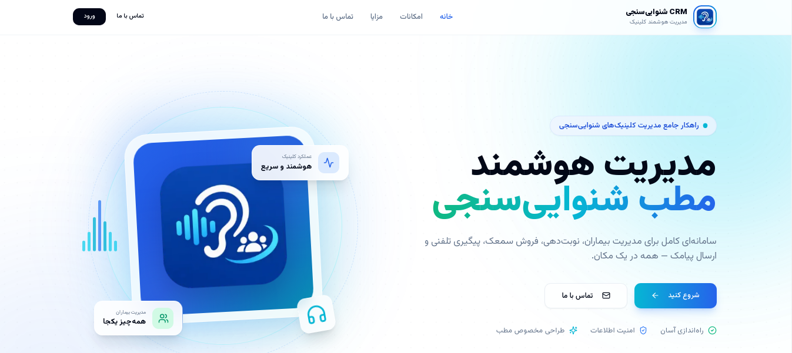

<div align="center">



<br/>
<br/>

<p>
  A multi-tenant SaaS CRM built for audiology clinics — patient records, appointments, sales, SMS campaigns, and call follow-ups in one dashboard.
</p>

<p>
  <a href="https://crm-app-zeta-peach.vercel.app">
    <strong>🔗 Live Demo</strong>
  </a>
  &nbsp;·&nbsp;
  <a href="https://github.com/UI88UX/crm-app">
    <strong>📦 Source Code</strong>
  </a>
</p>

<br/>

<hr/>

<h3>⚠️ Active Development</h3>

<p>
  This project is under active development. Features are being added and refined continuously.<br/>
  The database schema and API may change without notice.
</p>

<hr/>

</div>

<br/>

## About

This CRM was built specifically for audiology practices. It covers the daily workflow of a clinic: from a patient's first hearing test to follow-up calls months later.

It is a **multi-tenant SaaS platform**: every clinic operates in its own isolated workspace, and the platform owner manages all clinics from a dedicated Super Admin Panel.

The application is designed for Persian-speaking users. The entire UI is in Persian with full RTL support and Jalali calendar integration. Behind the scenes, it uses PostgreSQL with row-level security to keep data isolated per clinic.

This is a real tool used in a real clinic, not a demo project. Every feature was built to solve an actual problem.

<br/>

## Tech Stack

| Layer | Technologies |
| --- | --- |
| **Frontend** | Next.js 15 (App Router), React 18, TypeScript |
| **UI** | Tailwind CSS, shadcn/ui, Radix UI, Lucide Icons |
| **State & Forms** | TanStack React Query, React Hook Form, Zod |
| **Backend** | Supabase (PostgreSQL, Auth, Storage, Realtime) |
| **Integrations** | Melipayamak (Iranian SMS gateway) |
| **Utilities** | moment-jalaali, react-multi-date-picker |
| **Deployment** | Vercel |

<br/>

## Features

### Patient Management
Create and maintain patient profiles with contact details, national ID, address, emergency contacts, and attached files (images, PDFs). Search by name, national code, or phone number.

### Appointment Scheduling
Book appointments with Jalali calendar support. Each appointment has a type (visit, consultation, follow-up) and a status workflow: scheduled → confirmed → completed / cancelled / no-show. Quick appointment creation is available directly from a patient's profile.

### Sales Tracking
Record sales tied to specific patients. Filter and search sales history. The dashboard shows monthly revenue and sales trends.

### SMS Campaigns
Build audience segments using filters like last visit date, hearing aid brand, purchase history, city, gender, and SMS consent status. Preview the recipient count before sending. Schedule campaigns for a future date. Message templates support patient variable substitution such as `{{patient.first_name}}`.

### Call Follow-ups
Schedule follow-up calls with a due date. Log call results (successful, callback, no answer, cancelled). The dashboard shows reminders for calls that are due. A complete audit trail of past follow-ups is maintained.

### Authentication
Email/password authentication via Supabase Auth, with email confirmation, password recovery, and protected routes that redirect based on user role.

### Super Admin Panel

The platform owner (Super Admin) has a dedicated, isolated admin panel — separate from the clinic dashboard — for managing the entire SaaS platform.

**Tenant Management**
Create, view, edit, and deactivate clinic instances. Each tenant has its own isolated data scope, and the Super Admin can see a summary of each clinic's users, patients, and sales volume from a single view.

**Cross-Tenant User Management**
Add or remove users across any tenant. Assign roles, reset credentials, and control access without needing to log into each clinic separately.

**Platform-Wide Dashboard**
Aggregated metrics across all tenants: total clinics, active users, total patients, total sales, and SMS campaign volume. This is the operational view of the entire platform, not just one clinic.

**User Impersonation**
Super Admins can "log in as" any user in any tenant to troubleshoot issues exactly as that user sees them. A persistent banner indicates an active impersonation session, with a one-click exit. This is essential for support without asking for credentials.

**Access Control**
The Super Admin panel is protected by a separate authentication flow and is not reachable from the clinic dashboard. Only the platform owner has access.

### Admin & Permissions

Role-based access control with three levels: **Super Admin**, **Admin**, and **User**.

- **Super Admin** — The platform owner. Has access to the dedicated Super Admin Panel (see above). Can manage tenants, add/remove users across any clinic, view platform-wide analytics, and impersonate users for support.
- **Admin** — Clinic-level administrator. Manages users, patients, appointments, sales, and SMS campaigns within their own clinic only.
- **User** — Standard clinic staff. Access is scoped to their assigned role within the clinic.

Each clinic (tenant) has its own isolated data. Row Level Security (RLS) policies enforce tenant separation at the database level — a clinic Admin cannot see data from another clinic, even if they try to bypass the UI.

<br/>

## Architecture Notes

### Database-level security
Access rules are enforced at the database level using PostgreSQL Row Level Security (RLS) policies. Every table has explicit policies that restrict access based on the authenticated user's role and tenant. Hiding something in the UI is not the same as preventing access to it.

### Auto-synced user profiles
Supabase stores authentication records in `auth.users`, which is not directly queryable from the client. A PostgreSQL trigger automatically creates a matching row in the public `users` table when a new user registers. This keeps profile data consistent without relying on every registration flow to remember a second operation.

### Server state with React Query
All server interactions go through TanStack React Query, with defined query keys for caching and invalidation. This keeps server data separate from UI state and gives consistent loading and error handling across the app.

### Multi-tenant by design
Every major table (patients, appointments, sales, campaigns) includes a `tenant_id` column. RLS policies ensure users can only access data belonging to their own clinic. A Super Admin role can operate across tenants when needed.

### Isolated Super Admin surface
The Super Admin panel is a separate route group with its own authentication guard. It is not part of the tenant dashboard and cannot be reached by clinic-level users. This keeps platform-level operations (tenant management, impersonation, cross-tenant analytics) outside the reach of tenant-scoped roles.

<br/>

## Getting Started

### Prerequisites

- Node.js 20 or later
- npm, yarn, or pnpm
- A Supabase project (free tier works)

### Installation

```bash
git clone https://github.com/UI88UX/crm-app.git
cd crm-app
npm install
cp .env.example .env.local
npm run dev
```

The app should be available at http://localhost:3000.

<br/>

## ⚙️ Environment Variables

> **This section is important.** The project will not boot without a correctly configured `.env.local`. Every variable below is required unless marked optional. If you are reviewing this repository for hiring purposes, this section also reflects how the app separates client-safe configuration from server-only secrets.

Create a `.env.local` file at the root of the project by copying `.env.example`:

```bash
cp .env.example .env.local
```

Then fill in the values:

```env
# ─── Supabase ────────────────────────────────────────────────
# Project URL from Supabase Dashboard → Settings → API
NEXT_PUBLIC_SUPABASE_URL=your_supabase_project_url

# Public anon key — safe to expose to the browser (RLS protects data)
NEXT_PUBLIC_SUPABASE_ANON_KEY=your_supabase_anon_key

# ⚠️ Server-only. Never expose this to the client.
SUPABASE_SERVICE_ROLE_KEY=your_service_role_key

# ─── App ─────────────────────────────────────────────────────
NEXT_PUBLIC_SITE_URL=http://localhost:3000

# ─── SMS (Melipayamak) ───────────────────────────────────────
MELIPAYAMAK_USERNAME=your_username
MELIPAYAMAK_PASSWORD=your_password
MELIPAYAMAK_FROM=your_sender_number
MELIPAYAMAK_BODY_ID=your_template_id

# ─── Internal ────────────────────────────────────────────────
BACKUP_CRON_SECRET=your_random_secret
```

### Variable reference

| Variable | Scope | Purpose |
| --- | --- | --- |
| `NEXT_PUBLIC_SUPABASE_URL` | Client + Server | Supabase project endpoint. |
| `NEXT_PUBLIC_SUPABASE_ANON_KEY` | Client + Server | Public key used with RLS for authenticated queries. |
| `SUPABASE_SERVICE_ROLE_KEY` | **Server only** | Bypasses RLS. Used in API routes, cron jobs, and server actions. |
| `NEXT_PUBLIC_SITE_URL` | Client + Server | Base URL for auth redirects and email links. |
| `MELIPAYAMAK_USERNAME` | Server only | SMS gateway account username. |
| `MELIPAYAMAK_PASSWORD` | Server only | SMS gateway account password. |
| `MELIPAYAMAK_FROM` | Server only | Sender number registered with Melipayamak. |
| `MELIPAYAMAK_BODY_ID` | Server only | Template ID for the SMS body pattern. |
| `BACKUP_CRON_SECRET` | Server only | Shared secret that authorizes the backup cron endpoint. |

### 🔐 Security notes

- **`SUPABASE_SERVICE_ROLE_KEY` must never be exposed to the client.** It bypasses Row Level Security. Use it only in server-side code — API routes, cron jobs, and server actions. Never import it into a component or reference it with a `NEXT_PUBLIC_` prefix.
- **`NEXT_PUBLIC_*` variables are bundled into the client.** Anything with that prefix is public. Do not put secrets behind it.
- **`BACKUP_CRON_SECRET`** should be a long, random string (e.g. `openssl rand -hex 32`). The cron endpoint rejects any request without a matching header.
- **Never commit `.env.local`.** It is already listed in `.gitignore`. If a secret is ever leaked, rotate it in the Supabase dashboard and the SMS provider immediately.
- **RLS is the real guardrail.** Even if the anon key is public (it is, by design), Row Level Security policies prevent cross-tenant access at the database level.

<br/>

### Project Structure

```text
src/
├── app/                    # Next.js App Router
│   ├── dashboard/          # Protected dashboard routes (per-tenant)
│   │   ├── patients/       # Patient management
│   │   ├── appointments/   # Appointment scheduling
│   │   ├── sales/          # Sales tracking
│   │   ├── sms/            # SMS campaigns
│   │   ├── call-followups/ # Call follow-up workflow
│   │   └── users/          # User management
│   ├── admin/              # Super Admin panel (isolated)
│   │   ├── (protected)/    # Tenant & platform management
│   │   └── login/          # Separate admin authentication
│   ├── login/              # Clinic authentication pages
│   └── api/                # Route handlers
├── components/             # Reusable UI components
│   ├── ui/                 # shadcn/ui primitives
│   ├── appointments/       # Appointment-specific components
│   ├── call-followups/     # Follow-up components
│   └── providers/          # Context providers
├── hooks/                  # Custom React hooks
├── lib/                    # Utilities, Supabase client, validations
├── slices/                 # Redux slices (UI state only)
└── types/                  # Shared TypeScript types
```

<br/>

## Roadmap

- [ ] Complete responsive audit across all dashboard pages
- [ ] Comprehensive test coverage (Vitest + Playwright)
- [ ] Export reports to Excel / PDF
- [ ] Full migration scripts for one-command database setup
- [ ] CI/CD pipeline with automated preview deployments
- [ ] Detailed API documentation
- [ ] Subscription / billing integration per tenant
- [ ] Usage-based limits (patient count, SMS quota) per tenant plan
- [ ] Audit log for Super Admin actions (tenant creation, user removal, impersonation)

<br/>

## Contact

**Hossein** — Frontend & Full-stack Developer

- GitHub: [@UI88UX](https://github.com/UI88UX)
- Live app: [crm-app-zeta-peach.vercel.app](https://crm-app-zeta-peach.vercel.app)

<br/>

## License

This project is not licensed for public distribution. For inquiries about usage or collaboration, please reach out directly.

<br/>

<div align="center">
<sub>Built with Next.js and Supabase. Still a work in progress.</sub>

</div>